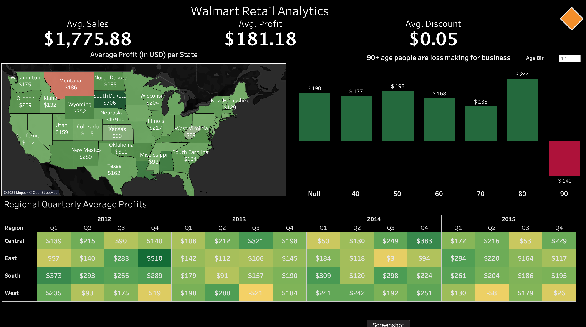

# Walmart Retail Analytics Tableau

This demonstrates dashboards built for Revenue and Profit Analysis done for Walmart Retail data using Tableau

Building this project involved 
  - ETL 
  - Data Cleaning
  - Creating Calculated fields for Insights
  - Building visualizations 
  - Publishing the dashboard

The dashboard can be found at :
https://public.tableau.com/app/profile/harish.kumar7404

## End
